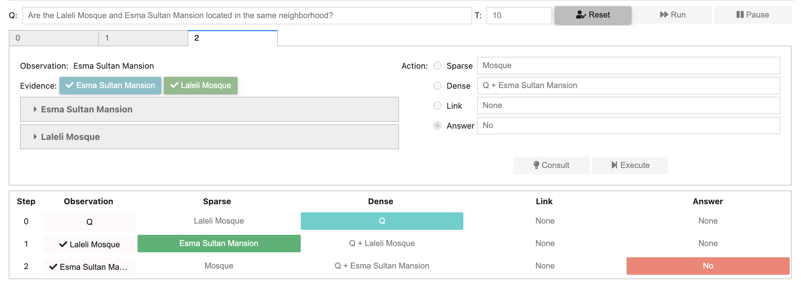

# AISO

This repository hosts the authors' implementation of the paper [Adaptive Information Seeking for Open-Domain Question Answering](https://arxiv.org/pdf/2109.06747.pdf), published in EMNLP 2021.


## Usage

### Set up environment

Our experiments are conducted on Python 3.6 and PyTorch 1.4.

We employ [GoldEn retriever]() as our query reformulator for the sparse retriever, so you need also install elasticsearch, java >= 8 and corenlp (run `install_corenlp.sh`).

### Prepare index and training data

See [index_sparse.ipynb](index_sparse.ipynb), [gen_step_data.ipynb](gen_step_data.ipynb).

### Training

See [train_union.py](train_union.py).

### Inference

See [game.ipynb](game.ipynb).

## Demo

The front-end of the demo in the first GIF is not open source, but we provide a simple visual interface based on jupyter widgets in the [notebook](demo.ipynb).



## TODO

- [ ] Convert jupyer notebooks to scripts
- [ ] More dependencies detail about environment setup
- [ ] Upload processed training data and model checkpoints

## Citation

```
@inproceedings{zhu-etal-2021-adaptive,
    title = "Adaptive Information Seeking for Open-Domain Question Answering",
    author = "Zhu, Yunchang  and
      Pang, Liang  and
      Lan, Yanyan  and
      Shen, Huawei  and
      Cheng, Xueqi",
    booktitle = "Proceedings of the 2021 Conference on Empirical Methods in Natural Language Processing",
    month = nov,
    year = "2021",
    address = "Online and Punta Cana, Dominican Republic",
    publisher = "Association for Computational Linguistics",
    url = "https://aclanthology.org/2021.emnlp-main.293",
    pages = "3615--3626",
}
```

